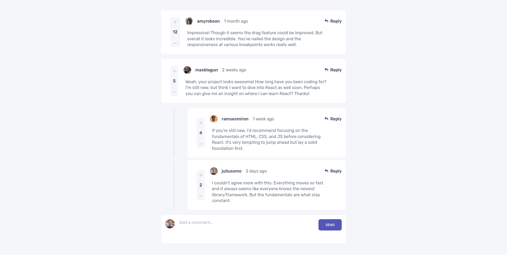

# Frontend Mentor Solution to Interactive Comment Section

This is my solution to the Frontend Mentor challenge "Interactive Comment Section"

## Table of contents

- [Overview](#overview)
  - [Screenshot](#screenshot)
  - [Links](#links)
- [My process](#my-process)
  - [Built with](#built-with)
  - [What I learned](#what-i-learned)
  - [Continued development](#continued-development)
- [Author](#author)

## Overview

I was tasked with recreating this site using the design specified. As a bonus, I also add some simple state to the upvote buttons

### Screenshot

### Links

- [Solution URL](https://github.com/JaidanBrown/interactive-comments-section)
- [Live Site](https://jaidanbrown.github.io/interactive-comments-section/)

## My process

### Built with

- ReactJS
- Sass

### Continued development

To continue the development of this project, I will add functionality to add, edit and delete comment. I could also implement user authentication and make a public style comment section.

## Author

- Website - [Jaidanbrown.dev](https://jaidanbrown.dev)
- Frontend Mentor - [@JaidanBrown](https://www.frontendmentor.io/profile/JaidanBrown)
